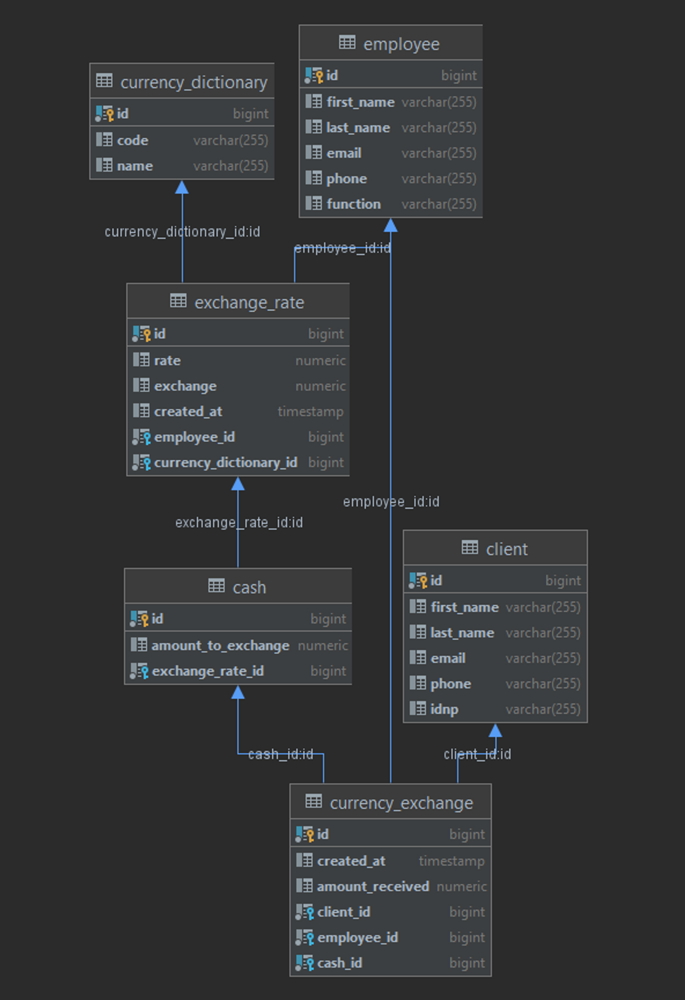

This project represents the currency exchange from any currency to lei
At the moment we have the following functionalities:
- add exchange_rate
- get exchange_rate
- add exchange_currency
- change the amount that was added in Cash

We also have connections with Customers and Employees
The transactions preserve the identity of both parties,
so we can generate reports in the future!

#Do it before running

1) Create a docker container using this command:
   `
   docker run --name exchange -e POSTGRES_PASSWORD=postgres -d -p 5432:5432 postgres
   `

2) Create all tables from file: `tables.sql`
3) Insert all mock values from file: `dataset.sql`
4) Run project
5) Do POST localhost:8080/rates
   `{
   "currencyCode": "EUR",
   "rate": "1",
   "exchange": "19.39"
   }`
6) Do GET localhost:8080/rates?currencyCode=EUR
7) Do POST localhost:8080/currency
   `{
   "currencyCode": "EUR",
   "amountToExchange": 2000
   }`
8) Do PUT localhost:8080/cash
   `{
   "cashId": 1,
   "amount": 20.20
   }`
   